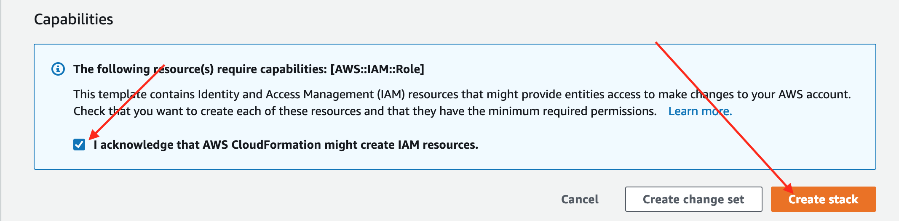
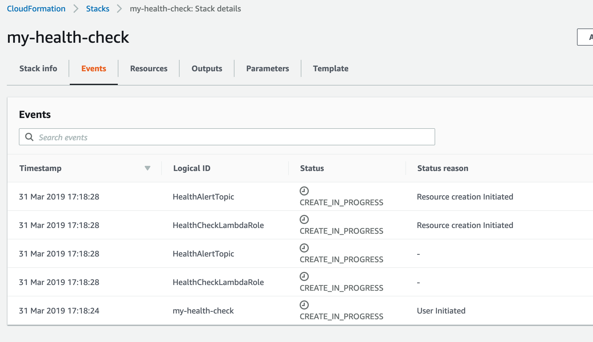

# go-aws-http-healtcheck

A small go app for health checking endpoints, and collecting other metrics about the base connectivity.

### Deploy

1. Log in to your AWS console

1. Click [this link](https://us-west-2.console.aws.amazon.com/cloudformation/home?region=us-west-2#/stacks/create/review?templateURL=https://s3-us-west-2.amazonaws.com/kloudcover-public-us-west-2-601394826940/healthcheck/stack.yml&stackName=my-health-check&param_ServiceName=google&param_ServiceURL=https://www.google.com&param_Environment=prod) to prepare the stack.

1. Add your specific URL, and your phone number for alerts


1. Click the classic IAM button, and click "Create Stack".


1. Watch all your resources come alive


1. Once the stack is done being created, take down the service! Scale to zero, DDOS yourself, do what you do.

1. Wait for that text message.


### Rationale

Golang has some interesting http tracing data that we can pull from the http library. If a request is successful, we can get more information from the request and post that information to a namespace within AWS CloudWatch. I'd like to deploy this with every one of my applications so that I can create default metrics to health endpoints simply for healthcheck.

As far as the metrics or a custom scraper for those metrics, I'm considering putting that into a different repository.

```
# reports metrics to cloudwatch  
docker run -it --rm -e REGION=us-west-2 -e METRIC_NAME=clustermaestro -e URL="http://my-ip.clustermaestro.com" healthcheck

```

### Metrics

Created in the AWS AppHealth namespace

| Metric Name | Values | Type | Description |
| ------------| ------ | ---- | ----------- |
| `is-up` | `1` or `0`  | milliseconds (dumb I know)  | Is the site up? 0 means no, 1 means `200` response code was returned |
| `dns-lookup`| `0 - n` | milliseconds | How long the dns lookup took to complete |
| `server-processing` | `0 - n` | milliseconds | How long it took for the server to process the request |
| `tcp-connection` | `0 - n` | milliseconds | How long it took for the tcp connection to be established |
| `tls-handshake` | `0 - n` | milliseconds | How long the tls handshake took to accomplish |
| `total` | `0 - n` | milliseconds | Total request time with all that stuff above |
